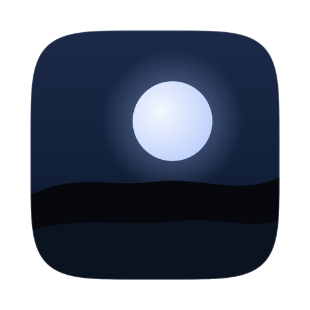
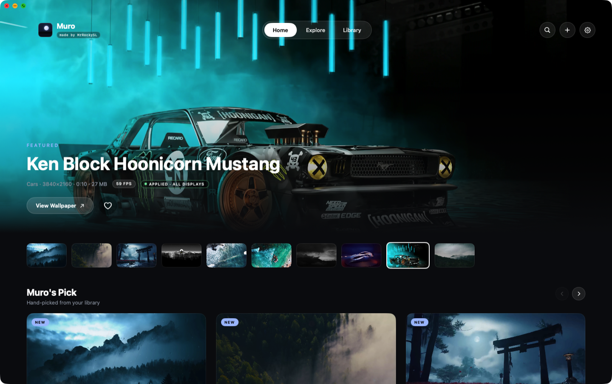

<div align="center">



# Muro

### Live wallpapers for your Mac, with low CPU and RAM usage. Free.


[](../../releases/latest)

</div>

---

## Why I built this

A still desktop picture is a waste of a good screen. But every live wallpaper
app I tried came with a catch. Usually a subscription, or a Pro tier holding the
good wallpapers hostage, or worst of all, a fan that spins up the second you set
one.

Most of them are Electron apps wrapping a web page. They sit at 300 to 400 MB of
RAM and keep your CPU warm all day, for a picture that moves.

## What Muro does

Muro is a native macOS app that plays looping video wallpapers on every display,
and lets you browse them in a full screen gallery. It's written in Swift and
SwiftUI, hands video decoding to the Apple Silicon media engine instead of the
CPU, and pauses itself the moment you can't see it.

Everything is free. No Pro tier, no paywall, no license key, no account. Every
wallpaper and every feature is unlocked.

---

## Features

- 🌙 **Live video wallpapers.** Looping, seamless, on every display at once.
- 🔒 **Lock screen live wallpapers.** Play a wallpaper on your lock screen too, not just the desktop. Set it to the desktop, the lock screen, or both, per display. Requires macOS 26 or newer.
- 🪶 **Around 2% CPU while playing.** HEVC decoded in hardware, never on the CPU.
- 😴 **Pauses itself** on full screen apps, display sleep, screen lock, Low Power Mode and low battery. A paused wallpaper costs 0% CPU.
- ⚡ **Smooth or Efficient.** Keep a wallpaper's original frame rate, or drop it to 30 fps to halve the power draw. Your choice, per wallpaper.
- 🖼️ **Explore gallery.** Browse the catalog, preview full screen, download only what you want.
- 🔄 **New wallpapers arrive on their own.** The library updates without updating the app. More on that below.
- 📃 **Playlists.** Rotate through a set on a timer, shuffled or in order.
- 📥 **Import your own.** Drop in any video and it gets transcoded once to HEVC and added to your library.
- 🎛️ **Menu bar controls.** Play, pause, skip and switch wallpapers without opening the app.
- 💾 **Space control.** See what each wallpaper costs on disk, and remove downloads you're done with.
- 🆓 **Free and open source** (MIT).

> Requires macOS 14 (Sonoma) or newer on an Apple Silicon Mac. The build is
> arm64 only and leans on the Apple Silicon media engine for hardware HEVC
> decoding. On macOS 26 and later the interface uses SwiftUI's native liquid
> glass; on older versions it falls back to translucent materials, which looks
> slightly different but works the same.

---

## What it looks like

<p align="center">
  
</p>

---

## Install

1. Download the latest DMG from the [Releases](../../releases/latest) page.
2. Open it and drag Muro into your Applications folder.
3. Let it through macOS security. Muro is free and self signed rather than
   carrying a paid Apple notarised certificate, so macOS blocks the first launch
   with a *"can't be opened… Apple could not verify it is free of malware"*
   warning. To get past it:
   - Double click the app once, then close the warning.
   - Open System Settings, go to Privacy & Security, scroll down to the message
     about Muro, and click **Open Anyway**, then **Open** to confirm.
   - *(On older macOS you can right click the app instead, then pick Open twice.)*
4. Open Explore, pick a wallpaper, hit Apply. Done.

> Muro keeps running in your menu bar after you close the window. That's what
> keeps your wallpaper playing. Use the menu bar icon to control it, or Quit to
> stop it.

---

## New wallpapers arrive on their own

You never have to update the app to get new wallpapers.

Muro re-reads its online catalog every time it launches or comes to the front,
so anything newly published shows up in your Explore tab within about a minute.
This works on every install that already exists, including older versions.

Videos only download when you pick one, and you can remove them again from the
Library tab whenever you want the space back.

---

## Build from source

```bash
git clone https://github.com/MrRockySL/Muro.git
cd Muro/Muro
./build-app.sh --install     # builds, bundles, signs, installs to /Applications
```

`./build-app.sh --dmg` also produces `dist/Muro-<version>.dmg`.

The package builds MuroKit, which holds the shared engine and library code, the
app itself, and a handful of command line tools (`muro-engine`, `muro-import`,
`muro-set`, `muro-prepare` and `muro-publish`) that read the same config and
library files as the app.

---

## How it works

Muro is native the whole way down: Swift, SwiftUI and AVFoundation. No Electron,
no web views.

The wallpaper is a video playing in a window that sits just below your desktop
icons, decoded in hardware by the Apple Silicon media engine, so the CPU barely
participates. The moment the wallpaper can't be seen, Muro pauses it, and a
paused wallpaper costs nothing.

---

## Contributing

This is an open project and contributions are very welcome. Found a bug, have an
idea, or want to improve something? [Open an issue](../../issues) or send a pull
request. Let's make it better together.

---

## Credits

[Wallspace](https://wallspace.app) was the inspiration. It showed what a live
wallpaper app for the Mac should look and feel like, and Muro's design takes its
idea from there.

---

## License

[MIT](LICENSE), free to use and share. This covers the code only. Want something
changed? [Open an issue](../../issues).

The wallpaper videos are not covered by the MIT license. Each one belongs to its
original creator and is redistributed here under its own terms.

Made by [MrRockySL](https://github.com/MrRockySL).
