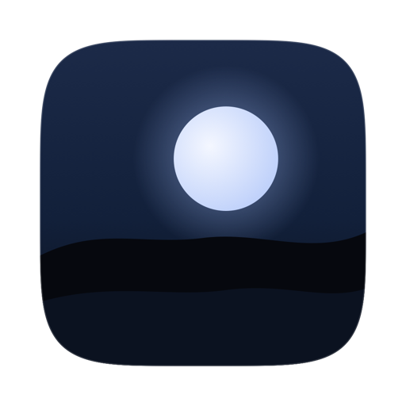
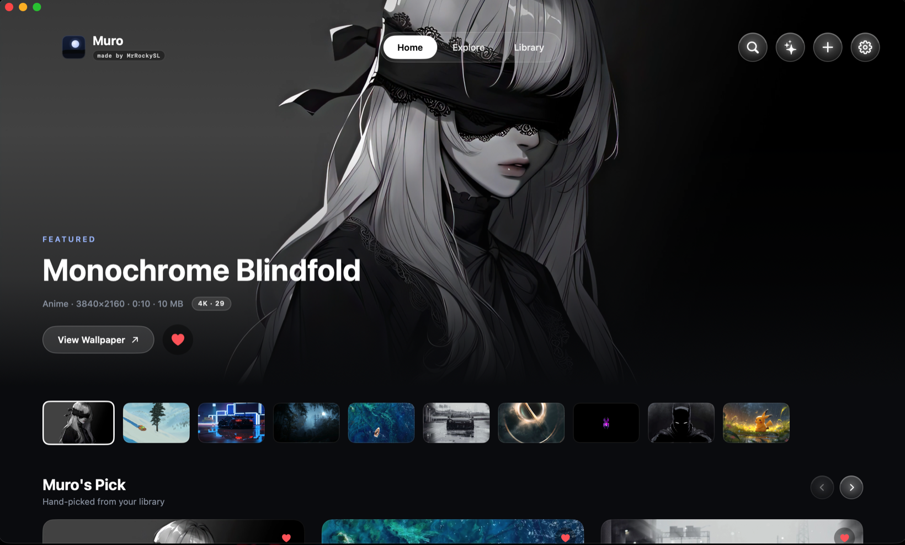

<div align="center">



# Muro

### Live wallpapers for your Mac, with low CPU and RAM usage. Free.


[](../../releases/latest)

</div>

---

## Why I built this

A still desktop picture is a waste of a good screen. But most of the live
wallpaper apps I tried came with a catch. Usually a subscription, or a Pro tier
holding the good wallpapers hostage.

Most of them are Electron apps wrapping a web page. They sit at 300 to 400 MB of
RAM and keep your CPU warm all day, for a picture that moves.

## What Muro does

Muro is a native macOS app that plays looping video wallpapers on every display,
and lets you browse them in a full screen gallery. It's written in Swift and
SwiftUI, hands video decoding to the Apple Silicon media engine instead of the
CPU, and pauses itself the moment you can't see it.

Everything is free. No Pro tier, no paywall, no license key, no account. Every
wallpaper and every feature is unlocked.

---

## Features

- 🌙 **Live video wallpapers.** Looping, seamless, on every display at once.
- 🔒 **Lock screen live wallpapers.** Play a wallpaper on your lock screen too, not just the desktop. Set it to the desktop, the lock screen, or both, per display. Requires macOS 26 or newer.
- 🪶 **Around 2% CPU while playing.** HEVC decoded in hardware, never on the CPU.
- 😴 **Pauses itself** on full screen apps, display sleep, screen lock, Low Power Mode and low battery. A paused wallpaper costs 0% CPU.
- ⚡ **Smooth or Efficient.** Keep a wallpaper's original frame rate, or drop it to 30 fps to halve the power draw. Your choice, per wallpaper.
- 🖼️ **Explore gallery.** Browse the catalog, preview full screen, download only what you want.
- 🔄 **New wallpapers arrive on their own.** The library updates without updating the app. More on that below.
- 📃 **Playlists.** Rotate through a set on a timer, shuffled or in order.
- ⏱️ **Automations.** Give every wallpaper its own time. Ten seconds each, or a full day schedule where each wallpaper has its own hours.
- ⏸️ **Pause after a set time.** Let a wallpaper play for a while after it changes or after you unlock, then hold still. Set it in seconds, minutes or hours.
- 🗑️ **Delete what you do not want.** Remove wallpapers one at a time or several at once, imported videos included.
- 📥 **Import your own.** Drop in any video and it gets transcoded once to HEVC and added to your library.
- 🎛️ **Menu bar controls.** Play, pause, skip and switch wallpapers without opening the app.
- ✨ **Tells you when there is a new Muro.** What's New shows what changed in the release and downloads it for you.
- 💾 **Space control.** See what each wallpaper costs on disk, and remove downloads you're done with.
- 🆓 **Free and open source** (MIT).

> Requires macOS 14 (Sonoma) or newer on an Apple Silicon Mac. The build is
> arm64 only for now, so it will not run on an Intel Mac. An Intel build is
> planned. On macOS 26 and later the interface uses SwiftUI's native liquid
> glass; on older versions it falls back to translucent materials, which looks
> slightly different but works the same.

---

## What it looks like

<p align="center">
  
</p>

<p align="center">
  <a href="https://github.com/MrRockySL/Muro/releases/download/v3.0/muro-demo.mp4"><strong>Watch Muro in action</strong></a>
</p>

---

## Install

### Homebrew

```bash
brew install --cask MrRockySL/muro/muro
```

### Manual download

1. Download the latest DMG from the [Releases](../../releases/latest) page.
2. Open it and drag Muro into your Applications folder.

On first launch, let it through macOS security. Muro is free and self signed
rather than carrying a paid Apple notarised certificate, so macOS blocks the
first launch with a *"can't be opened… Apple could not verify it is free of
malware"* warning. To get past it:

1. Double click the app once, then close the warning.
2. Open System Settings, go to Privacy & Security, scroll down to the message
   about Muro, and click **Open Anyway**, then **Open** to confirm.
3. On older macOS, you can right click the app instead, then pick Open twice.

Open Explore, pick a wallpaper, hit Apply. Done.

> Muro keeps running in your menu bar after you close the window. That's what
> keeps your wallpaper playing. Use the menu bar icon to control it, or Quit to
> stop it.

---

## Set it and forget it

Muro can change your wallpaper for you, two different ways.

**On a timer.** Pick a set of wallpapers, give each one a length, and Muro
cycles through them. Ten seconds each, or an hour each, whatever suits. Every
change is a crossfade, never a black flash.

**By the clock.** Give each wallpaper its own hours instead. Something calm for
the morning, something else after dark. The day is drawn as a 24 hour timeline
you drag, so you can see the whole thing at a glance rather than typing times
into boxes.

Only one runs at a time, and you can start or stop either from the menu bar
without opening the app.

---

## Let it play, then let it rest

A moving wallpaper is lovely for a minute and distracting for an hour.

**Pause after** lets a wallpaper play for a set time after it changes or after
you unlock your Mac, then hold still on a frame. Set it in seconds, minutes or
hours. It applies to everything by default, and any single wallpaper can
override it or opt out entirely.

A held frame costs no CPU at all, so this is the lightest Muro ever gets while
still showing you something you chose.

---

## Your library, your rules

Every wallpaper in your Library has a delete button, and you can select several
and clear them together. Videos you imported yourself can go too, which was not
possible before 3.0.

Nothing is ever deleted without asking first, and deleting a wallpaper cleans up
everything that pointed at it: playlists, automations, and the lock screen.

---

## Muro tells you when there is a new version

When a new Muro is released, the What's New button in the top bar picks it up on
its own. You get a dot on the button and a small note saying an update is
available.

Open it and you see what actually changed in that release, read straight from
the release itself, with a button that downloads the new version for you. The
notes for the version you are already running sit underneath.

---

## New wallpapers arrive on their own

You never have to update the app to get new wallpapers.

Muro re-reads its online catalog every time it launches or comes to the front,
so anything newly published shows up in your Explore tab within about a minute.
This works on every install that already exists, including older versions.

Videos only download when you pick one, and you can remove them again from the
Library tab whenever you want the space back.

---

## Build from source

```bash
git clone https://github.com/MrRockySL/Muro.git
cd Muro/Muro
./build-app.sh --install     # builds, bundles, signs, installs to /Applications
```

`./build-app.sh --dmg` also produces `dist/Muro-<version>.dmg`.

The package builds MuroKit, which holds the shared engine and library code, the
app itself, and a handful of command line tools (`muro-engine`, `muro-import`,
`muro-set`, `muro-prepare` and `muro-publish`) that read the same config and
library files as the app.

---

## How it works

Muro is native the whole way down: Swift, SwiftUI and AVFoundation. No Electron,
no web views.

The wallpaper is a video playing in a window that sits just below your desktop
icons, decoded in hardware by the Apple Silicon media engine, so the CPU barely
participates. The moment the wallpaper can't be seen, Muro pauses it, and a
paused wallpaper costs nothing.

---

## Support and contribute

If Muro has made your Mac a little more enjoyable, you can support its continued
development through [GitHub Sponsors](https://github.com/sponsors/MrRockySL).

Contributions are welcome too. Found a bug, have an idea, or want to improve
something? [Open an issue](../../issues) or send a pull request. Let's make Muro
better together.

---

## License

[MIT](LICENSE), free to use and share. This covers the code only. Want something
changed? [Open an issue](../../issues).

The wallpaper videos are not covered by the MIT license. Each one belongs to its
original creator and is redistributed here under its own terms. See
[NOTICE](NOTICE.md).

Made by [MrRockySL](https://github.com/MrRockySL).
